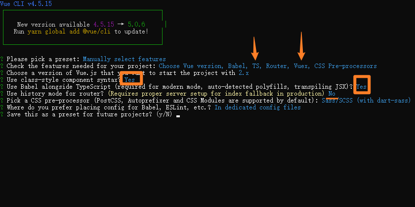

# 外卖App-day01

## 1 搭建环境

### 1.1 安装node JS 

### 1.2 配置yarn & 环境变量

### 1.3 配置淘宝镜像

### 1.4 安装 vue/cli 脚手架

```js
yarn global add @vue/cli

npm i @vue/cli -g
```

## 2 创建项目



## 3 配置工程目录

- src
  - api 接口管理层
  - assets 静态资源目录
  - components 公共小组件
  - filters 全局过滤器
  - mixins 混淆
  - router 路由
  - store vuex
  - utils 工具文件夹
  - views 页面级别组件文件夹
  - App.vue 顶级根组件
  - main.ts 入口文件

## 4 CSS 框架选择-REM

- 安装&引入

```js
#安装依赖
npm install lib-flexible postcss-plugin-px2rem --save-dev
yarn add lib-flexible postcss-plugin-px2rem -D

入口文件 main.js 使用
#引入flexible帮助转化 px to rem
import "lib-flexible/flexible";
```

- 配置写在vue.config.js里面

```js
module.exports = {
  css: { //css处理器
    loaderOptions: {
      postcss: {
        plugins: [
          require('postcss-plugin-px2rem')({
            //设计图宽度 750px -》75 420px-》42
            rootValue: 42, //换算基数， 默认100  ，这样的话把根标签的字体规定为1rem为50px,这样就可以从设计稿上量出多少个px直接在代码中写多上px了。
            // unitPrecision: 5, //允许REM单位增长到的十进制数字。
            //propWhiteList: [],  //默认值是一个空数组，这意味着禁用白名单并启用所有属性。
            // propBlackList: [], //黑名单
            // exclude: /(page_pc)/i,  //默认false，可以（reg）利用正则表达式排除某些文件夹的方法，例如/(node_module)/ 。如果想把前端UI框架内的px也转换成rem，请把此属性设为默认值
            exclude: /(node_modules|public)/i,
            // selectorBlackList: ['van-'], //要忽略并保留为px的选择器,我们一般不转换vantui中的大小
            // ignoreIdentifier: false,  //（boolean/string）忽略单个属性的方法，启用ignoreidentifier后，replace将自动设置为true。
            // replace: true, // （布尔值）替换包含REM的规则，而不是添加回退。
            mediaQuery: false,  //（布尔值）允许在媒体查询中转换px。
            minPixelValue: 3 //设置要替换的最小像素值(3px会被转rem)。 默认 0
          }),
        ]
      }
    }
  },
}
```

- 或者写在外面 新建postcss.config.js

```js
module.exports = {
  plugins: [
    require('postcss-plugin-px2rem')({
      //设计图宽度 750px -》75 420px-》42
      rootValue: 42, //换算基数， 默认100  ，这样的话把根标签的字体规定为1rem为50px,这样就可以从设计稿上量出多少个px直接在代码中写多上px了。
      // unitPrecision: 5, //允许REM单位增长到的十进制数字。
      //propWhiteList: [],  //默认值是一个空数组，这意味着禁用白名单并启用所有属性。
      // propBlackList: [], //黑名单
      // exclude: /(page_pc)/i,  //默认false，可以（reg）利用正则表达式排除某些文件夹的方法，例如/(node_module)/ 。如果想把前端UI框架内的px也转换成rem，请把此属性设为默认值
      exclude: /(node_modules|public)/i,
      // selectorBlackList: ['van-'], //要忽略并保留为px的选择器,我们一般不转换vantui中的大小
      // ignoreIdentifier: false,  //（boolean/string）忽略单个属性的方法，启用ignoreidentifier后，replace将自动设置为true。
      // replace: true, // （布尔值）替换包含REM的规则，而不是添加回退。
      mediaQuery: false, //（布尔值）允许在媒体查询中转换px。
      minPixelValue: 3, //设置要替换的最小像素值(3px会被转rem)。 默认 0
    }),
  ],
}

```

### 4.1 页面居中

- App.vue

```vue
<style lang="scss">
.App {
  max-width: 10rem;
  margin: 0 auto;
  height: 100%;
}
</style>
```


## 5 看需求 选择适合的UI框架 OR 自己写

- PC 管理系统 element-ui NO1
- h5 vant-ui[https://vant-contrib.gitee.io/vant/v2/#/zh-CN/] NO1 

```js
# Vue 3 项目，安装最新版 Vant：
npm i vant -S

# Vue 2 项目，安装 Vant 2：
npm i vant@latest-v2 -S

```

- 按需引用步骤

  - 安装插件

    ```js
    npm i babel-plugin-import -D
    yarn add babel-plugin-import -D
    ```

  - babel.config.js

  ```js
  module.exports = {
    presets: [
      '@vue/cli-plugin-babel/preset'
    ],
    plugins: [
      ['import', {
        libraryName: 'vant',
        libraryDirectory: 'es',
        style: true
      }, 'vant']
    ]
  }
  ```

  - main.ts 引入和注册 组件

    ```js
    //引入组件
    import { Button } from 'vant'
    //注册组件 插件的形式
    Vue.use(Button)
    ```

  - 使用组件

  ```js
  <van-button type="primary">主要按钮</van-button>
      <van-button type="info">信息按钮</van-button>
      <van-button type="default">默认按钮</van-button>
      <van-button type="warning">警告按钮</van-button>
  <van-button type="danger">危险按钮</van-button>
  ```

## 6 配置路由

## 7 axios 配合vuex 把储存异步数据

### 7.1 ajax三层封装

- utils/request.ts

```js
/* ajax工具函数 */
import axios from 'axios'

#创建一个实例
const instance = axios.create({
    baseURL: '', //默认请地址
    timeout: 10000, //默认超时时间
})

//请求拦截器
instance.interceptors.request.use(
    (config) => {
        return config
    },
    (err) => {
        return Promise.reject(err)
    }
)

//响应拦截器
instance.interceptors.response.use(
    (response) => {
        return response
    },
    (err) => {
        return Promise.reject(err)
    }
)

//导出实例
export default instance

```

- api/goods.ts [接口管理层]

```js
/* app接口模块 */

//引入request 工具函数
import request from '@/utils/request';

/* 获取商品数据 */
export const getGoodsListReq = () => {
    return request({
        method: 'get',
        url: '/goods/goods_list'
    })
}
/* 获取店铺信息 */
export const getShopInfoReq = () => {
    return request({
        method: 'get',
        url: '/shop/seller'
    })
}
/* 获取店铺评论 */
export const getShopRatingsReq = () => {
    return request({
        method: 'get',
        url: '/shop/ratings'
    })
}
```

- .vue组件层调用

### 7.2 vuex 配置异步数据存储

- store/index.ts

```js
import Vue from 'vue'
import Vuex from 'vuex'

Vue.use(Vuex)

#引入ajax函数
import { getShopInfoReq } from "@/api/goods";

export default new Vuex.Store({
  state: {
    //店铺信息
    shopInfo: {}
  },
  mutations: {
    //mutaions里面的方法 可以同步修改state数据
    SET_SHOP_INFO(state, payload) {
      state.shopInfo = payload
    }
  },
  actions: {
    #获取店铺信息
    async get_shop_info({ commit }) {
      //发送请求
      let res = await getShopInfoReq()
      //解构数据
      let { data } = res.data
      //数据赋值 commit调用mutations里面的方法去修改state的数据
      commit('SET_SHOP_INFO', data)
    }
  },
  modules: {
  }
})
```

- home/index.vue

```js

<script lang="ts">
import { Vue, Component, Prop } from "vue-property-decorator";
#引入mapActions mapState
import { mapActions, mapState } from "vuex";
interface INav {
  path: string;
  title: string;
}

//装饰器 里面可以写vue2语法
@Component({
  #数据在computed里面解构
  computed: {
    ...mapState(["shopInfo"]),
  },
  #方法在methods里面解构
  methods: {
    ...mapActions(["get_shop_info"]),
  },
})
export default class Home extends Vue {
  active: number = 2;
  get_shop_info: any; #函数占位
  navList: Array<INav> = [
    {
      path: "/home/goods",
      title: "商品",
    },
    {
      path: "/home/comment",
      title: "评价",
    },
    {
      path: "/home/shop",
      title: "商家",
    },
  ];
  created() {
    #初始化发请求
    this.get_shop_info();
  }
}
</script>
```


## 8 导航条功能实现

```vue
<!-- 导航 -->
      <!-- color 主体颜色 下滑条 -->
      <!-- title-active-color选中字体颜色 -->
      <!-- to 相当于router-link to -->
      <!-- title 标题 -->
      <!-- name 绑定字符串 赋值是当前地址 -->
      <!-- v-model 获取当前地址 与name属性的值匹配  -->
      <van-tabs color='#fcc40b' title-active-color='#fcc40b' v-model="active">
        <van-tab :to='item.path' :name='item.path' :title="item.title"
          v-for="item in navList" :key="item.path">
        </van-tab>
      </van-tabs>

<script>
export default class Home extends Vue {
  #active 赋值为当前路由地址
  active: string = this.$route.path;
}
</script>
```

## 作业: 手写vuex4步骤2次


