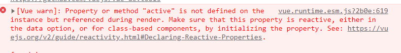
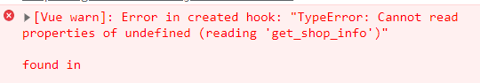
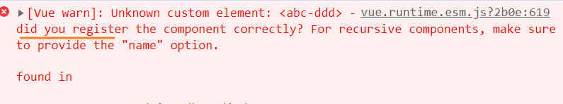
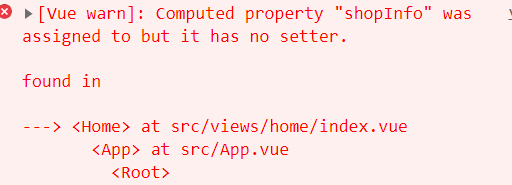
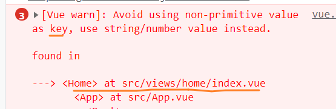
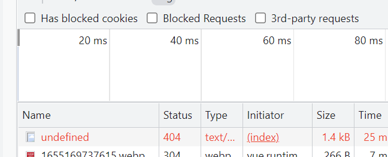
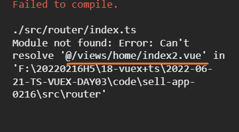

# 外卖App-day02 

## 0 vue常见问题

- 变量没定义
  - 把active 复制去代码搜 如果只有一个 就没定义 去data里面定义数据 或在methods里面定义方法



- undefined read 属性
  - 把get_shop_info 复制 去代码搜谁在用. 用它的值undefined



- 语法错误 找代码中红色部分去对应修改
- 组件使用错误
  - 组件没有注册
  - 组件注册了,使用写错了



- 计算属性 如果没有setter函数 不能赋值



- 父传子的数据 子用props来接收的 不能修改 
  - 因为遵循单向数据流原则
- v-for 循环key问题 
  - key必须是number/string 的唯一值 



- 异步渲染数据问题
  - 用三目运算 有数据再渲染
  - v-if作用与 标签异步有数据再渲染



- 模块引用错误
  - 复制去搜 字打错或者模块没创建



## 1 better-scroll

https://better-scroll.github.io/docs/zh-CN/guide/base-scroll-options.html#startx

BetterScroll 是一款重点解决移动端（已支持 PC）各种滚动场景需求的插件。它的核心是借鉴的 [iscroll (opens new window)](https://github.com/cubiq/iscroll)的实现，它的 API 设计基本兼容 iscroll，在 iscroll 的基础上又扩展了一些 feature 以及做了一些性能优化。

BetterScroll 是使用纯 JavaScript 实现的，这意味着它是无依赖的。


- **父容器固定高度**
- **子容器内容超过父容器**
- 父容器**只有一个儿子[子容器]**

### 1.1 安装2x版本

```js
npm install @better-scroll/core --save

// or

yarn add @better-scroll/core
```

### 1.2 使用

- store/index.ts

```js
 //获取商品数据
    get_goods_list({ commit }) {
      return new Promise(async (resolve) => {
        //发送请求
        let res = await getGoodsListReq()
        //解构数据
        let { goodsList } = res.data;
        //commit调用mutations里面的同步方法 同步修改state数据
        commit('SET_GOODS_LIST', goodsList) #一份数据扔给 vuex
        #一份数据扔外面使用
        resolve(goodsList)
      })
    }
```

- goods/index.vue

```vue
<!-- 左侧导航 -->
<div class="sidebar fn" id="sidebar">
    <van-sidebar v-model="activeKey">
        <van-sidebar-item v-for="item in navList" :key="item" :title="item" />
    </van-sidebar>
</div>

<script lang="ts">
#1引入bs
import BScroll from "@better-scroll/core";
export default class Goods extends Vue {
  #mounted 可以操作dom
  async mounted() {
    #发送请求获取商品列表数据
    await this.get_goods_list();
    #下面代码等待上面执行完毕再执行 
    #this.$nextTick dom更新完毕之后 执行里面回调函数
    this.$nextTick(() => {
      #创建bs实例 参数1 dom 参数2 配置项
      let scroll = new BScroll("#sidebar", {
        scrollY: true, #开启纵向滚动
        click: true, #可以点击
      });
    });
  }
}
</script>
```

### 1.3 左联动右

```vue
#1 给good-item绑定一个有索引的id
<div class="good-item" :id="'g'+index" v-for="(item,index) in goodsList">
    
#2 给sidebar-item 绑定点击事件 把当前索引传递给activeKey 
$event 子传父的数据
 <van-sidebar-item @click="activeKey = $event;handleLeftClick()"
          v-for="item in navList" :key="item" :title="item" />
<script lang="ts">
export default class Goods extends Vue {
  rightScroll: any;
  //mounted生命周期 可以操作dom
  async mounted() {
    await this.get_goods_list();
    this.$nextTick(() => {
      let leftScroll = new BScroll("#sidebar", {
        scrollY: true,
        click: true,
      });
    #3 把右侧实例挂在this上
    this.rightScroll = new BScroll("#rightContent", {
        scrollY: true,
        click: true,
      });
    });
  }
  #4 左侧点击
  handleLeftClick() {
    #右侧实例 滚动到索引指定位置 参数1 dom 参数2 时间 参数34 偏移量
    this.rightScroll.scrollToElement("#g" + this.activeKey, 1000, 0, 0);
  }
}
</script>
```

### 1.4 Loading 思想

- 用Loading 变量 代表正在做某件事
- 如果loading为true的情况下  其他的操作禁止
- 到事做完了 才可以进行其他操作

### 1.5 右侧联动左侧 

```js
export default class Goods extends Vue {
  heightList: Array<number> = []; //装good-item 高度
 #3 loading: boolean = false; //左侧是否点击
  //mounted生命周期 可以操作dom
  async mounted() {
    this.$nextTick(() => {
      setTimeout(() => {
        this.rightScroll = new BScroll("#rightContent", {
          scrollY: true,
          click: true,
          probeType: 3, //派发滚动事件
        });

        /* 
         分析盒子高度 和 索引关系
         0-1 0
         1< <1+2  1
         1+2< 1+2+3 2
         1+2+3< <1+2+3+4 3
         前面盒子的和 <  <前面盒子的和+当前盒子高度  索引就是当前盒子的索引

         先决条件 把所有盒子的高度装进一个数组里面
        */

        #1 把good-item高度装进数组
        let nodeList = document.querySelectorAll(".good-item");
        nodeList.forEach((v: any) => {
          this.heightList.push(v.clientHeight);
        });

        #2 监听正在滚动
        this.rightScroll.on("scroll", ({ y }: any) => {
          #获取当前滚动高度
          let py: number = Math.abs(y);
          #5 如果左侧在点击 右侧不需要去监听计算
          if (this.loading) return;

          this.heightList.reduce(
            (total: number, cur: number, index: number): number => {
              # 前面盒子的和 <  <前面盒子的和+当前盒子高度  索引就是当前盒子的索引
              if (py > total && py < total + cur) {
                #把索引赋值给 左侧选中索引
                this.activeKey = index;
              }
              return total + cur;
            },
            0
          );
        });

        # 6监听滚动结束 把loading还原为false 代表左联动右已结结束
        this.rightScroll.on("scrollEnd", () => {
          this.loading = false;
        });
      }, 200);
    });
  }
  #左侧点击
  handleLeftClick() {
    //右侧滚动到指定位置
    this.rightScroll.scrollToElement("#g" + this.activeKey, 1000, 0, 0);
    #4 把loading变为true
    this.loading = true;
  }
}
```


## 2 $nextTick & 问题


