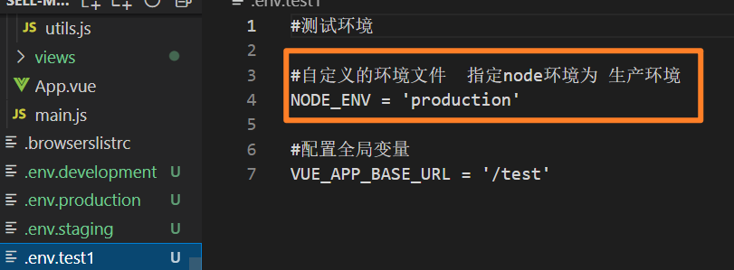

# 外卖App-day03

## 1 修饰符 

## 2 vuex 数据处理

- store/index.ts

```js

//食品约束
interface IFood {
  category: string
  ctime: string
  goodsDesc: string
  id: number
  imgUrl: string
  name: string
  price: number
  rating: number
  ratings: Array<IRate>
  sellCount: number
  count?: number #1选中食品
}

export default new Vuex.Store({

  getters: {
    #3 赛选已经选中的食品
    filterFoods(state) {
      let temp: Array<IFood> = []
      state.goodsList.forEach((v: IGood) => {
        v.foods.forEach((subV: IFood) => {
          // 非空断言
          if (subV.count! > 0) {
            temp.push(subV)
          }
        })
      })
      return temp
    },
    #6 已赛选食品的总数量
    filterFoodsCount(state, getters) {
      return getters.filterFoods.reduce((total: number, cur: IFood): number => {
        return total + cur.count!
      }, 0)
    }
  },
 
  actions: {
   
    //获取商品数据
    get_goods_list({ commit }) {
      return new Promise(async (resolve) => {
        //发送请求
        let res = await getGoodsListReq()
        //解构数据
        let { goodsList } = res.data;
        #2修改数据 添加选中字段初始值0
        goodsList.forEach((v: IGood) => {
          v.foods.forEach((subV: IFood) => {
            subV.count! = 0
          })
        })

        //commit调用mutations里面的同步方法 同步修改state数据
        commit('SET_GOODS_LIST', goodsList)
        resolve(goodsList)
      })
    }
  },

})
```

- goods/index.vue

```vue
<template>
  <div class="Goods df">
    <!-- 左侧导航 -->
    <div class="sidebar fn" id="sidebar">
      <van-sidebar v-model="activeKey">
        <!-- $event 子传父的数据 -->
        <van-sidebar-item @click="activeKey = $event;handleLeftClick()"
          v-for="item in navList" :key="item" :title="item" />
      </van-sidebar>
    </div>
    <!-- 右侧内容 -->
    <div class="right-content f1" id="rightContent">
      <div>
        <!-- 商品 -->
        <div class="good-item" :id="'g'+index" v-for="(item,index) in goodsList"
          :key="item.name">
          <h3 class="title">{{item.name}}</h3>
          <!-- 食品 -->
          <van-card v-for="subItem in item.foods" :key="subItem.id"
            class="food-item" :price="subItem.price" :desc="subItem.goodsDesc"
            :title="subItem.name" :thumb="subItem.imgUrl">
             
            #找到圆角步进器 绑定vuex里面添加的count字段
            <template #footer>
              <van-stepper v-model="subItem.count" theme="round"
                button-size="22" min="0" max="10" disable-input />
            </template>

          </van-card>
        </div>
      </div>
    </div>
  </div>
</template>
```

- 5 home/index.vue

```vue
<template>
  <div class="Home">
    
    <!-- 购物车 -->
    <van-goods-action>
      <van-goods-action-icon icon="chat-o" text="客服" />
      <van-goods-action-icon :badge="filterFoodsCount"
        @click="filterFoodsCount && showPop()" icon="cart-o" text="购物车" />
      <van-goods-action-icon icon="shop-o" text="店铺" />
      <van-goods-action-button type="danger" text="立即购买" />
    </van-goods-action>

    <!-- 弹窗 -->
    <van-popup v-model="show" position="bottom" :style="{ height: '50%' }">
      <!-- 食品 -->
      <van-card v-for="subItem in filterFoods" :key="subItem.id"
        class="food-item" :price="subItem.price" :desc="subItem.goodsDesc"
        :title="subItem.name" :thumb="subItem.imgUrl">
        <template #footer>
          <van-stepper v-model="subItem.count" theme="round" button-size="22"
            min="0" max="10" disable-input />
        </template>
      </van-card>
    </van-popup>
  </div>
</template>

<script lang="ts">
import { Vue, Component, Prop } from "vue-property-decorator";
//引入mapActions
import { mapActions, mapState, mapGetters } from "vuex";


//装饰器 里面可以写vue2语法
@Component({
  computed: {
    ...mapGetters(["filterFoods", "filterFoodsCount"]),
  },
})
</script>
```

## 3 环境开发&打包

- 默认环境文件
  - .env.development

  ```js
  #VUE_APP_ 开头会被打入src文件夹里面
  #设置全局 主机地址前缀 
  VUE_APP_BASE_URL ='/dev'
  ```

  - .env.production

    ```js
    #VUE_APP_ 开头会被打入src文件夹里面
    #设置全局 主机地址前缀 
    VUE_APP_BASE_URL ='/pro'
    ```

- package.json

  ```js
  "scripts": {
      "serve": "vue-cli-service serve", #加载.env.development
      "build": "vue-cli-service build" #加载.env.production
    },
  ```

### 多环境打包

- 新建4个环境文件 如果是自定义的必须加上 NODE_ENV



- package.json

```js
"scripts": {
    "serve": "vue-cli-service serve",
    "build": "vue-cli-service build",
    "build:test": "vue-cli-service build --mode test1", #自定义打包 要指定模式 --mode 模式名 = 加载.env.模式 环境文件
    "build:staging": "vue-cli-service build --mode staging"
  },
```

- request.js

```js
#执行不同的命令就会加载不同的 环境前缀
axios.defaults.baseURL = process.env.VUE_APP_BASE_URL
```

- 打包出来 接口就会自带前缀 交给后端

## 4 前缀跨域

- vue.config.js

```js
#前提 接口带前缀或者不带前缀
#webpack的 devServer是本地代理服务器   proxy属性进行前缀跨域
#把识别的前缀 前面地址转为target目标地址 进行跨域
#如果需要去掉前缀 就pathRewrite 干掉前缀
      devServer: {
        port: 3000, //端口号
        open: true, //是否热启动
        proxy: {
          '/dev': { #相当把 http://localhost:3000/dev/xxxxx 变成http://localhost:5000/dev/xxxxx
            target: 'http://localhost:5000', #把/dev前面所有的替换为目标target地址
            ws: true,
            changOrigin: true, //是否跨域
            pathRewrite: {
               #如果后端带前缀 就不重写 
               #如果后端不带前缀 就把你的跨域前缀重写干掉
              '^/dev': '/' 
            }
          },
        }
      },
```

